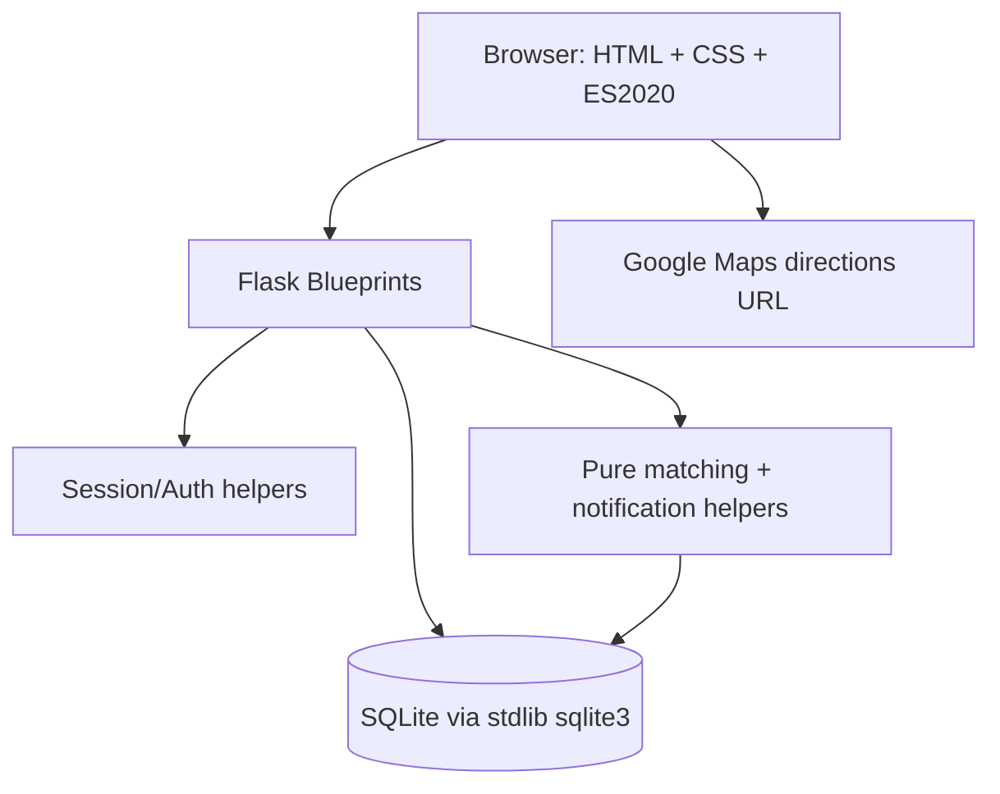

# ShareCircle

> A neighborhood needs-and-skills exchange that turns local generosity into measurable community impact.

[](https://github.com/elite-coders/sharecircle/actions/workflows/test.yml) [](LICENSE) [](https://www.python.org/)

## Problem

Neighborhood help is often fragmented across chats, noticeboards, and memory. Someone can have the exact skill or spare item another person needs, yet the two never meet. ShareCircle creates one lightweight local place where people post needs, post offers, discover explainable matches, coordinate in a private thread, and earn Impact Points after successful help.

## 30-second flow

1. Join with a name, username, email, location, and password.
2. Post a Need or an Offer; browser geolocation can add optional coordinates.
3. Helpers open Nearby to see open needs matching their available offer categories, sorted by distance and urgency.
4. Accept a need; ShareCircle creates an accepted match and a six-digit OTP for the need owner.
5. Navigate with the plain Google Maps directions URL, mark arrival, deliver the service, and wait for the need owner to record payment.
6. The need owner reveals the OTP after payment; the helper enters it to complete the match.
7. Completion awards 15 Impact Points to the need owner and 20 to the helper, then both can rate each other.

## Features

- Server-side signed sessions with Werkzeug password hashing.
- Needs and Offers with category, urgency or availability, status, and optional coordinates.
- Pure Python explainable matching engine with deterministic scoring.
- Private per-match messaging with three-second polling and unread counts.
- Gig-style active match state machine: accepted → arrived → paid → completed, with OTP verification, payment recording, and OTP regeneration after three failed attempts.
- Nearby helper feed filtered to the categories of the user’s available offers and sorted by Haversine distance plus urgency.
- Google Maps directions via the public `maps/dir/?api=1&destination=lat,lng` URL scheme with no API key.
- Two-way post-completion ratings and reputation averages.
- Public profiles with stats, recent activity, and needs/offers tabs.
- Google Maps directions links using the public /maps/dir/?api=1&destination=lat,lng URL scheme, with no Google Maps SDK or API key. ShareCircle stores coordinates only for proximity discovery and directions.
- In-app notifications with ten-second polling and unread badges.
- Search, category and urgency filters, and sorting by newest, urgency, or matches.
- Community Impact dashboard and CSS-only category chart.
- Leaderboard with Impact Points.
- Dedicated `/nearby` discovery feed and `/match/<id>` active-match page with direct Google Maps directions links.
- Match cancellation with safe release of the need/offer back into the community pool before payment.
- Privacy-aware public impact receipt verification links with native share/copy support.
- Password-protected `/reset-data` demo tool with destructive confirmation.
- Responsive dark mode, accessible dialogs, reduced-motion support, loading states, toasts, counters, and mobile bottom navigation.
- Local no-op sponsor hooks for Twilio, SendGrid, Mapbox, and Stripe.
- Seed data for twenty users, thirty needs, forty offers, fifteen completed matches, ratings, messages, and twenty notifications.
- Pytest coverage for authentication, CRUD, matching, gig-flow lifecycle, nearby discovery, ratings, messages, location updates, and explainability.

## Tech stack

Python 3.11+, Flask, stdlib `sqlite3`, HTML5, CSS3, and vanilla ES2020 JavaScript. No ORM, Node.js, npm, bundler, frontend framework, map SDK, or required API key.

## Setup

```text
pip install -r requirements.txt
python app.py
# open http://localhost:5000
# optional: python seed.py          (demo data, password123)
# optional: python -m pytest        (run tests)
# optional: python make_zip.py      (build sharecircle.zip)
# optional: host="0.0.0.0" in app.run for LAN access
# optional: ngrok http 5000         (public URL)
```

## Project structure

```text
sharecircle/
├── app.py
├── seed.py
├── make_zip.py
├── requirements.txt
├── README.md
├── LICENSE
├── CONTRIBUTING.md
├── CODE_OF_CONDUCT.md
├── .gitignore
├── .github/
│   ├── workflows/test.yml
│   ├── ISSUE_TEMPLATE/bug.md
│   ├── ISSUE_TEMPLATE/feature.md
│   └── PULL_REQUEST_TEMPLATE.md
├── migrations/
│   └── 001_gig_flow.sql
├── app/
│   ├── __init__.py
│   ├── auth.py
│   ├── categories.py
│   ├── config.py
│   ├── db.py
│   ├── schema.sql
│   ├── integrations.py
│   ├── matching.py
│   ├── notifications.py
│   ├── blueprints/
│   │   ├── auth.py
│   │   ├── main.py
│   │   └── api.py
│   ├── templates/
│   └── static/
└── tests/
    ├── conftest.py
    └── test_app.py
```

## Architecture



Request flow: browser → Flask blueprint → validation/session → parameterized SQLite queries → pure matching or notification helpers → HTML/JSON response. No build step is required between source and localhost.

## Awards fit

### Best UI/UX

A coherent design system, accessible dialogs, keyboard interactions, mobile navigation, dark mode, reduced-motion behavior, skeleton loading, animated counters, responsive cards, filters, toasts, and visual match explanations make the workflow understandable rather than form-heavy.

### Best Social Welfare

ShareCircle is purpose-built around unmet neighborhood needs, practical volunteer offers, safe private coordination, measurable completed matches, and public community impact.

### Best Beginner Team

The architecture stays readable: an app factory, three blueprints, a single database module, one matching module, small helpers, no ORM, no frontend build system, and conventional Flask templates/static folders.

### Best Open Source

The repository includes MIT licensing, contributor guidance, a code of conduct, CI, issue templates, PR checklist, seed data, tests, architecture documentation, and a one-command ZIP builder.

### Best Use of Sponsor Technology

Integration seams are already called from real user flows for SMS, email, geocoding, and donation processing. Each seam is a small no-op function that can later be connected to sponsor APIs without changing the rest of the application.

### Best Innovation

The product turns a community match into a real local-service loop: proximity discovery, one-tap acceptance, directions, arrival, off-app payment recording, private OTP handoff, verified completion, and two-sided reputation. The original matching score remains explainable for needs that are still looking for help.

## Screenshots

Capture the polished localhost views for the landing page, dashboard, browse/matching flow, nearby feed, active match, profile, leaderboard, and impact dashboard. Store screenshots in a repository media folder if the team publishes a showcase page.

## Testing

Run `python -m pytest`. The suite uses a temporary SQLite database per test and covers the core product workflow plus pure matching behavior.

## Sponsor hooks

`app/integrations.py` intentionally provides safe no-op functions for Twilio, SendGrid, Mapbox, and Stripe. The gig flow does not require any sponsor API: payment is recorded locally, OTPs use Python `secrets`, and navigation uses a public directions URL. To wire a sponsor later, add its official SDK or HTTP call, read credentials from environment variables, keep the default local behavior safe, and add tests around the integration seam.

## License and credits

MIT © 2026 Elite Coders Hackathon Team. Built for CodeSprint by Elite Coders 2026.
